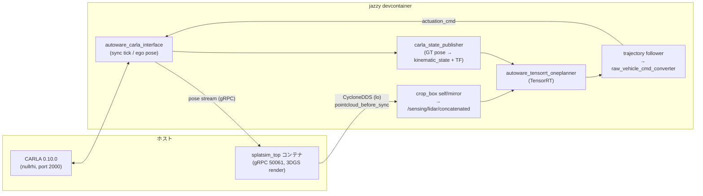

# SplatSim 3DGS × Autoware OnePlanner ローカル動作確認手順書

> **2026-08-21 動作確認済み** — CARLA 0.10.0(Odaiba)上で、3D Gaussian Splatting レンダラ(SplatSim ローカルイメージ)による LiDAR シミュレーション + OnePlanner E2E 走行を再現する手順。ゴール設定 → Engage → 自動走行、およびフル再起動の再現性まで確認済み。

**環境**: ROS 2 Jazzy devcontainer / CARLA 0.10.0 nullrhi / splatsim ローカルイメージ / GT自己位置(NDT不使用) / RTX 4090・Python 3.12(cp312)

## 構成: データフロー全体像



## 0. 前提: リポジトリとブランチ

ワークスペースは `~/workspace/autoware`。core は `~/Downloads/data/autoware.repos` 準拠(`autoware_internal_msgs 1.12.1` / `autoware_core 1.9.0` 世代)に揃えること。**coreが新しいと universe 側が偽のコンパイルエラーを起こす。**

| 役割 | リポジトリ / ブランチ | 確認済みコミット |
|---|---|---|
| universe | [hakuturu583/autoware.universe : `feat/autoware_tensorrt_oneplanner`](https://github.com/hakuturu583/autoware.universe/tree/feat/autoware_tensorrt_oneplanner) | [`c1226187f2`](https://github.com/hakuturu583/autoware.universe/commit/c1226187f2) |
| launcher | [hakuturu583/autoware_launch : `feat/oneplanner-carla010-splatsim`](https://github.com/hakuturu583/autoware_launch/tree/feat/oneplanner-carla010-splatsim) | [`291fc374`](https://github.com/hakuturu583/autoware_launch/commit/291fc374) |
| splatsim | [hakuturu583/splatsim : `feat/lidar-sector-streaming`](https://github.com/hakuturu583/splatsim/tree/feat/lidar-sector-streaming) | [`15ac143`](https://github.com/hakuturu583/splatsim/commit/15ac143) |
| ansible (spconv) | [hakuturu583/autoware : `fix/enable-spconv-ubuntu2404`](https://github.com/hakuturu583/autoware/tree/fix/enable-spconv-ubuntu2404) | — |
| core msgs | [autowarefoundation/autoware_internal_msgs : `1.12.1`](https://github.com/autowarefoundation/autoware_internal_msgs/tree/1.12.1) | — |

ビルドは必ず **jazzy devcontainer 内**で行う(host 直ビルドは不可)。OOM対策として並列は `MAKEFLAGS=-j4` + `--parallel-workers 4`。

## 1. splatsim イメージのビルド(ローカル)

SplatSim レンダラは GHCR ではなく**ローカルビルドしたイメージ**を使う。sector-streaming ブランチ(LiDAR を方位セクタ単位でレンダリングして高速化 + rolling shutter 改善)をビルドする:

```bash
git clone -b feat/lidar-sector-streaming https://github.com/hakuturu583/splatsim.git
cd splatsim
docker buildx build -f docker/Dockerfile -t splatsim:feat-lidar-sector-streaming .
```

- 要 BuildKit + NVIDIA Container Toolkit。既定は CUDA 12.8.1 / Ubuntu 22.04(`--build-arg CUDA_VERSION=... UBUNTU_VERSION=...` で変更可)
- 既定の `TORCH_CUDA_ARCH_LIST` は全アーキ入り(sm 7.5〜12.0+PTX)。RTX 4090 だけなら `--build-arg TORCH_CUDA_ARCH_LIST="8.9"` でビルド時間を短縮できる
- LiDARセクタ数は実行時 env `SPLATSIM_LIDAR_SECTORS`(既定1=off)、rolling shutter は `SPLATSIM_LIDAR_ROLLING_SHUTTER`(既定on)で制御
- autoware_carla_interface 側の既定は「ローカルにイメージがあれば pull しない」なので、このタグを `splatsim_image` に渡すだけでよい

> ⚠️ **旧イメージ不可**: 7/23以前のローカルイメージ(`splatsim:latest` 等)は sidecar v2 形式のシーン(`scene_c_unified.usdz`)を読めない(`unsupported sidecar version 2`)。必ずこのブランチのビルドを使うこと。

## 2. ローカルアセットの配置確認

| アセット | 場所 | 備考 |
|---|---|---|
| splatsim イメージ | `splatsim:feat-lidar-sector-streaming` | 手順1でビルド。GHCRからのpullは不要(ローカル優先が既定) |
| 3DGSシーン | `~/workspace/scene_c_unified.usdz` | 25.5M gaussians / sidecar v2。旧イメージでは読めない |
| CARLA wheel | `~/autoware_data/carla_wheels/carla-0.10.0-cp312-*.whl` | jazzy = Python 3.12 用 |
| マップ | `~/autoware_data/maps/odaibatest/`(`Odaiba` はsymlink) | **実体必須**: `.webauto` へのsymlinkはコンテナから見えず、実体が消えている事故もあった。ハードリンクで配置済み(dataset 433a2328、分割PCD 737MB) |
| OnePlannerモデル | `~/autoware_data/ml_models/oneplanner/` | `../oneplanner` へのsymlink。`oneplanner.param.json` と engine 一式 |
| センサマッピング | `~/autoware_data/carla_sensor_mapping_splatsim_lidar.yaml` | LiDAR top(HDL64E 64×2083)+ IMU + GNSS。カメラ無し |

## 3. devcontainer の再作成(docker.sock 付き)

splatsim コンテナを interface から起動するため `docker.sock` と、usdz をホストと同一パスで見せる identity mount が必要。override を用意して再作成する。

```yaml
# docker-sock-override.yaml
services:
  autoware-devel:
    volumes:
      - /tmp/.X11-unix:/tmp/.X11-unix:rw
      - ../..:/home/aw/autoware
      - ${HOME}/autoware_data:/home/aw/autoware_data
      - /var/run/docker.sock:/var/run/docker.sock
      - /home/masaya/workspace:/home/masaya/workspace:ro
```

```bash
cd ~/workspace/autoware/docker/devcontainer
docker compose -f universe-devel-cuda.compose.yaml \
  -f docker-sock-override.yaml -p aw-devel up -d
```

再作成のたびにコンテナ内依存の再導入が必要:

```bash
# spconv/cumm (oneplannerのビルドに必要。実行だけなら省略可)
docker exec -u root aw-devel-autoware-devel-1 bash -c '
  cd /tmp
  curl -fsSL -o cumm.deb   https://github.com/autowarefoundation/spconv_cpp/releases/download/spconv_v2.3.8%2Bcumm_v0.5.3%2Bcu130-rev1/cumm_0.5.3_amd64.deb
  curl -fsSL -o spconv.deb https://github.com/autowarefoundation/spconv_cpp/releases/download/spconv_v2.3.8%2Bcumm_v0.5.3%2Bcu130-rev1/spconv_2.3.8_amd64.deb
  apt-get install -y --no-install-recommends ./cumm.deb ./spconv.deb'

# Python依存 + CARLA client(setuptoolsを80未満に戻すこと。84だとcolconが壊れる)
docker exec -u root aw-devel-autoware-devel-1 bash -c '
  pip install --break-system-packages docker grpcio grpcio-tools protobuf "setuptools<80" \
    /home/aw/autoware_data/carla_wheels/carla-0.10.0-cp312-cp312-linux_x86_64.whl'

# RViz用のX許可(ホスト側で1回)
xhost +local:
```

## 4. ビルド(差分のみ)

```bash
docker exec aw-devel-autoware-devel-1 bash -c '
  cd /home/aw/autoware && source /opt/ros/jazzy/setup.bash &&
  export MAKEFLAGS=-j4 &&
  colcon build --symlink-install --parallel-workers 4 \
    --cmake-args -DCMAKE_BUILD_TYPE=Release \
    --packages-select autoware_carla_interface autoware_launch carla_sensor_kit_launch'
```

symlink-install なので Python の修正はノード再起動だけで反映される。proto stub はビルド時に自動生成される(手動生成物を `splatsim/proto/` に置かないこと)。

## 5. CARLA サーバ起動(ホスト、nullrhi)

```bash
export CARLA_ROOT=$HOME/Carla-0.10.0-Linux-Shipping/Carla-0.10.0-Linux-Shipping  # ネスト構造に注意
export CARLA_RENDER_MODE=nullrhi
bash ~/Downloads/data/run_carla_0_10.sh   # port 2000 が開けばOK(~10秒)
```

> ⚠️ kill 直後の再起動は silent 失敗する。`pkill -f CarlaUnreal` 後は**10秒以上待ってから**起動する。nullrhi は LiDAR raycast・マップロードとも安定(描画モードはこの環境では不安定)。

## 6. シミュレーション起動

起動スクリプトは `~/autoware_data/launch_splatsim_3dgs.sh`(devcontainer 内パスで記述)。要点は OnePlanner E2E 構成 + splatsim レンダリング:

```bash
ros2 launch autoware_launch e2e_simulator.launch.xml \
  simulator_type:=carla \
  map_path:=/home/aw/autoware_data/maps/Odaiba \
  carla_map:=Odaiba \
  data_path:=/home/aw/autoware_data \
  vehicle_model:=sample_vehicle sensor_model:=carla_sensor_kit \
  rviz:=true localization:=false \
  host:=localhost port:=2000 timeout:=60 \
  force_load_world:=true \
  min_positive_throttle:=0.6 \
  min_positive_throttle_speed_threshold:=0.8 \
  no_rendering_mode:=True \
  vehicle_type:=vehicle.taxi.ford \
  spawn_point:=-2638.530,2189.059,6.966,0.0,0.0,148.0 \
  spawn_point_ground_snap:=True spawn_point_ground_offset_z:=1.2 \
  initial_pose_ground_offset_z:=1.5 \
  map_origin_x:=92008.441357 map_origin_y:=45335.052882 \
  use_light_weight_sensor_mapping:=True \
  sensor_mapping_file:=/home/aw/autoware_data/carla_sensor_mapping_splatsim_lidar.yaml \
  render_with_splatsim:=true splatsim_render_lidar:=true splatsim_render_camera:=false \
  splatsim_image:=splatsim:feat-lidar-sector-streaming \
  splatsim_tileset_path:=/home/masaya/workspace/scene_c_unified.usdz \
  use_e2e_planner:=true e2e_planner_mode:=oneplanner
```

引数の要点:

- `data_path:=/home/aw/autoware_data` — **必須**。コンテナ内 root の HOME 既定 `/root/autoware_data` を避ける
- `localization:=false` — 自己位置はGT(`carla_state_publisher` が kinematic_state + map→base_link TF を合成)
- `force_load_world:=true` — 2回目以降の spawn 失敗対策(毎回ワールド再ロード)
- `min_positive_throttle:=0.6` — taxi.ford の発進対策(スロットル0.2では動かない)
- `map_origin_x/y` — CARLA原点↔map原点のオフセット(**必須**、0だとマップとズレる)
- `spawn_point` — 3DGSシーン覆域内の座標。シーンを差し替えたら覆域内か要確認
- `splatsim_tileset_path` — **ホストパス**で指定(docker daemon がバインドするため)

```bash
# デタッチ起動(通常の & はセッション終了で死ぬ)
docker exec -d aw-devel-autoware-devel-1 bash -lc \
  'bash /home/aw/autoware_data/launch_splatsim_3dgs.sh > /tmp/carla_3dgs.log 2>&1'
```

### lanelet2 ローダの別プロセス起動(必須ワークアラウンド)

map_container 内の lanelet2_map_loader は dlopen と lttng-ust の登録ロック衝突でコンテナごとデッドロックするため、**launch の20秒後を目安に別プロセスで起動する**:

```bash
docker exec -d aw-devel-autoware-devel-1 bash -c '
  source /opt/ros/jazzy/setup.bash && source /home/aw/autoware/install/setup.bash &&
  exec install/autoware_map_loader/lib/autoware_map_loader/autoware_lanelet2_map_loader \
    --ros-args -r __ns:=/map -r __node:=lanelet2_map_loader \
    -p use_sim_time:=true -p allow_unsupported_version:=true \
    -p center_line_resolution:=5.0 -p use_waypoints:=true \
    -p lanelet2_map_path:=/home/aw/autoware_data/maps/Odaiba/lanelet2_map.osm \
    -p enable_selected_map_loading:=false -p "lanelet2_map_metadata_path:=none" \
    -r output/lanelet2_map:=/map/vector_map > /tmp/lanelet_loader.log 2>&1'
```

## 7. 動作確認チェックリスト

devcontainer 内で `source /opt/ros/jazzy/setup.bash && source install/setup.bash` のうえ、起動から2〜3分後に確認する。

| 確認項目 | トピック / 手段 | 期待値 |
|---|---|---|
| 3DGS LiDAR | `/sensing/lidar/top/pointcloud_before_sync` | 10 Hz / 約10万点 |
| 前処理後点群 | `/sensing/lidar/concatenated/pointcloud` | 10 Hz |
| 自己位置 | `/localization/kinematic_state` | 約67 Hz |
| TF | `ros2 run tf2_ros tf2_echo map base_link` | Translation が出る |
| vector map | `/map/vector_map`(topic info) | Publisher count: 1 |
| OnePlanner | launchログ | `Missing input data ... route: false`(ゴール待ちならOK) |
| 診断 | RViz の Diagnostics | Map / Perception / Vehicle / System / **Motion** が緑 |
| splatsim render | `docker logs splatsim_top` | render ≈ 12 ms / frame |

> ✅ **許容される赤**: localization の scan_matching / accuracy / sensor_fusion(NDT用診断。GT自己位置構成では対象ノードが無い)と、ゴール設定前の trajectory_validation は **autonomous モードの依存に入っていない**ため赤のままで問題ない。

## 8. 走行(ゴール設定 → Engage)

1. RViz(autoware.rviz)で **2D Goal Pose** をレーン上に設定 → route 生成、OnePlanner が trajectory を出力開始
2. Motion が緑であることを確認して **AUTO(Engage)**
3. 発進時はスロットルが 0.6 まで引き上げられる(`min_positive_throttle`)。以降は actuation map どおり

## 9. 停止・再起動時の注意

**launch を kill してもノードは生き残る。** 複数の carla_interface が同一 CARLA を tick すると「止まる/暴れる」ため、再起動前に完全駆除する:

```bash
docker exec aw-devel-autoware-devel-1 bash -c '
  kill -TERM $(pgrep -f "e2e_sim[u]lator.launch") 2>/dev/null; sleep 5
  PIDS=$(ps -eo pid,args | grep -E "\-\-ros-args" | grep -v grep | awk "{print \$1}")
  kill -KILL $PIDS 2>/dev/null'
docker rm -f splatsim_top   # env変更を効かせたい場合(reuseされるため)
```

上記の駆除 → CARLA再起動 → launch → lanelet2ローダ投入をまとめた**ワンショット再起動スクリプト**を用意してある(付録E)。ホスト側で1コマンド:

```bash
bash ~/autoware_data/restart_3dgs_sim.sh
```

> ⚠️ **パターンの罠**: `pgrep -f` は自分自身のコマンドラインにもマッチする。パターンには `e2e_sim[u]lator` のようにブラケットを入れ、同一コマンド内で `/opt/ros/jazzy` 等の実文字列を含めない(sourceは別コマンドで)。

## 10. トラブルシューティング

| 症状 | 原因 | 対処 | 状態 |
|---|---|---|---|
| splatsim コンテナが exit 136(SIGFPE) | LiDAR専用 Initialize に intrinsics が無く、0×0カメラのwarmupレンダで CUDA ゼロ除算 | クライアントがダミー intrinsics(64×64)を送る | ✅ 修正済(universe) |
| `unsupported sidecar version 2` | 旧 splatsim イメージ(7/23)が新シーン形式非対応 | `feat/lidar-sector-streaming` 以降を使う | ✅ 運用で解決 |
| concatenated が出ない / component load が全停止 | ① topic_tools RelayNode が jazzy で型解決待ちハング ② compare_map がマップ待ちで無限ブロック(マップ破損時) | ① relay廃止し crop_mirror を直接remap ② マップ実体を修復 | ✅ 修正済 `291fc374`系 |
| vector map が出ない(map_containerごと沈黙) | lanelet2 ローダの dlopen × lttng-ust デッドロック | 手順6の別プロセス起動 | ⚠️ ワークアラウンド運用 |
| Engage後に発進しない(throttle≈0.2) | taxi.ford は小スロットルで発進不能 | `min_positive_throttle:=0.6` | ✅ 修正済 `c1226187f2` |
| Motion診断が恒久赤 | ① 未起動の control_command_gate の診断要求 ② 残骸ノードの重複検出 | ① system.yaml から該当ユニット削除 ② 手順9の完全駆除 | ✅ 修正済 `291fc374` |
| ego spawn 失敗(RuntimeError) | 前runの残骸 / ワールド状態の汚れ | `force_load_world:=true` + 完全駆除 | ✅ 運用で解決 |
| launch即死: centerpoint param not found | コンテナ内 root の HOME 既定で `data_path=/root/autoware_data` | `data_path:=/home/aw/autoware_data` を明示 | ✅ スクリプト反映済 |
| 初回起動後 数分間 無反応 | centerpoint の TensorRT エンジン初回ビルド | 待つ(2回目以降はキャッシュ) | ⚠️ 仕様 |

## 11. 既知の制限 / TODO

- **ステアリング調整未移植**: `steer_response_calibration_table` / `normalize_steer_command` 等は carla010 ブランチのみ。制御精度が必要なら移植する
- **splatsim 側の恒久修正**(tier4/splatsim へ): ① intrinsics 未設定時は warmup をスキップ(SIGFPE根治) ② PointCloud2 の `is_dense=true` 化(Autoware側で将来ERRORになる警告)
- **lanelet2 ローダ standalone 化の launcher 恒久化**(現状は手動起動)
- traffic light 認識は TensorRT モデル未配置で停止中(走行には影響なし、信号情報は空)
- devcontainer 再作成のたびに手順3の依存再導入が必要

## 12. 付録: スクリプト・設定ファイル全文

再現に必要なファイルの全文。配置パスはファイル名の見出しどおり。

### A. `~/autoware_data/launch_splatsim_3dgs.sh`(シミュレーション起動、devcontainer内で実行)

```bash
#!/usr/bin/env bash
# 3DGS (SplatSim) simulation with the OnePlanner E2E stack.
# Config ported from ~/Downloads/run_e2e_oneplanner_carla_0_10.sh, with:
#   - SplatSim LiDAR rendering (local image) instead of CARLA raycast
#   - spawn point inside the scene_c_unified.usdz 3DGS coverage
# Localization stack is OFF: carla_state_publisher (E2E infra) publishes
# /localization/kinematic_state and map->base_link TF from the CARLA GT pose.
source /opt/ros/jazzy/setup.bash
source /home/aw/autoware/install/setup.bash
export PYTHONNOUSERSITE=1
# SplatSim gRPC client uses protobuf; force pure-python impl for compatibility.
export PROTOCOL_BUFFERS_PYTHON_IMPLEMENTATION=python
exec ros2 launch autoware_launch e2e_simulator.launch.xml \
  simulator_type:=carla \
  map_path:=/home/aw/autoware_data/maps/Odaiba \
  carla_map:=Odaiba \
  data_path:=/home/aw/autoware_data \
  vehicle_model:=sample_vehicle \
  sensor_model:=carla_sensor_kit \
  rviz:=true \
  localization:=false \
  host:=localhost port:=2000 timeout:=60 \
  force_load_world:=true \
  min_positive_throttle:=0.6 \
  min_positive_throttle_speed_threshold:=0.8 \
  no_rendering_mode:=True \
  vehicle_type:=vehicle.taxi.ford \
  spawn_point:=-2638.530,2189.059,6.966,0.0,0.0,148.0 \
  spawn_point_ground_snap:=True \
  spawn_point_ground_offset_z:=1.2 \
  initial_pose_ground_offset_z:=1.5 \
  map_origin_x:=92008.441357 \
  map_origin_y:=45335.052882 \
  use_light_weight_sensor_mapping:=True \
  sensor_mapping_file:=/home/aw/autoware_data/carla_sensor_mapping_splatsim_lidar.yaml \
  render_with_splatsim:=true \
  splatsim_render_lidar:=true \
  splatsim_render_camera:=false \
  splatsim_image:=splatsim:feat-lidar-sector-streaming \
  splatsim_tileset_path:=/home/masaya/workspace/scene_c_unified.usdz \
  use_e2e_planner:=true \
  e2e_planner_mode:=oneplanner
```

### B. `~/Downloads/data/run_carla_0_10.sh`(CARLAサーバ起動、ホストで実行)

```bash
#!/usr/bin/env bash
# Start CARLA 0.10.0 with the same low-load defaults used by the Autoware tests.
set -eo pipefail

CARLA_ROOT="${CARLA_ROOT:-$HOME/Carla-0.10.0-Linux-Shipping}"
CARLA_SERVER="$CARLA_ROOT/Linux/CarlaUnreal.sh"
if [[ -z "${CARLA_RENDER_MODE+x}" ]]; then
  CARLA_RENDER_MODE="nullrhi"
fi

if [[ ! -x "$CARLA_SERVER" ]]; then
  echo "CARLA server not found or not executable: $CARLA_SERVER" >&2
  exit 1
fi

case "$CARLA_RENDER_MODE" in
  nullrhi)
    CARLA_ARGS=(-nullrhi -quality-level=Low)
    ;;
  offscreen)
    CARLA_ARGS=(-RenderOffScreen -quality-level=Low)
    ;;
  onscreen)
    CARLA_ARGS=(-quality-level=Low)
    ;;
  *)
    echo "Unknown CARLA_RENDER_MODE '$CARLA_RENDER_MODE' (expected nullrhi, offscreen, or onscreen)" >&2
    exit 1
    ;;
esac

exec "$CARLA_SERVER" "${CARLA_ARGS[@]}" "$@"
```

### C. `~/autoware_data/carla_sensor_mapping_splatsim_lidar.yaml`(センサマッピング)

```yaml
# SplatSim LiDAR sensor mapping (no cameras).
# LiDAR is rendered by the SplatSim gRPC renderer (render_with_splatsim:=true,
# splatsim_render_lidar:=true); IMU/GNSS still come from CARLA.
# Includes the SplatSim-specific LiDAR parameters (HDL-64E rig) required by the renderer.
default_sensor_kit_name: carla_sensor_kit_description

sensor_mappings:
  # LiDAR sensor (rendered by SplatSim)
  velodyne_top_base_link:
    carla_type: sensor.lidar.ray_cast
    id: top
    ros_config:
      frame_id: velodyne_top
      topic_base: /sensing/lidar/top
      topic_suffix: /pointcloud_before_sync
      frequency_hz: 10
      qos_profile: best_effort
    parameters:
      range: 100
      channels: 64
      points_per_second: 300000
      upper_fov: 10.0
      lower_fov: -30.0
      rotation_frequency: 20
      noise_stddev: 0.0
      # SplatSim rendering settings (used when render_with_splatsim:=true).
      sensor_type: HDL64E
      fps: 10.0
      n_rows: 64
      n_columns: 2083
      min_range_m: 0.9
      max_range_m: 120.0
      drop_threshold: 0.5
      alpha_threshold: 0.1

  # IMU sensor (from CARLA)
  tamagawa/imu_link:
    carla_type: sensor.other.imu
    id: imu
    ros_config:
      frame_id: tamagawa/imu_link
      topic: /sensing/imu/tamagawa/imu_raw
      frequency_hz: 50
      qos_profile: reliable
    parameters:
      noise_accel_stddev_x: 0.0
      noise_accel_stddev_y: 0.0
      noise_accel_stddev_z: 0.0
      noise_gyro_stddev_x: 0.0
      noise_gyro_stddev_y: 0.0
      noise_gyro_stddev_z: 0.0

  # GNSS sensor (from CARLA)
  gnss_link:
    carla_type: sensor.other.gnss
    id: gnss
    ros_config:
      frame_id: map
      topic: /sensing/gnss/pose_with_covariance
      frequency_hz: 2
      qos_profile: reliable
    parameters:
      noise_alt_stddev: 0.0
      noise_lat_stddev: 0.0
      noise_lon_stddev: 0.0
      noise_alt_bias: 0.0
      noise_lat_bias: 0.0
      noise_lon_bias: 0.0
    covariance:
      position_variance: 0.01
      orientation_variance: 1.0

normalization:
  strip_suffixes:
    - _base_link
    - _link
    - /camera_link

enabled_sensors:
  - velodyne_top_base_link
  - tamagawa/imu_link
  - gnss_link
```

### D. `~/autoware_data/maps/odaibatest/map_projector_info.yaml`(マップ投影設定)

```yaml
# Generated for the shinagawa_odaiba t4 dataset (835afe23-...).
# Verified: GeoConvert of lanelet2 node (lat 35.62318, lon 139.77841) -> 54SUE 89376 42842,
# which matches the lanelet2 local_x=89376.63 / local_y=42842.26.
projector_type: MGRS
vertical_datum: WGS84
mgrs_grid: 54SUE
```

### E. `~/autoware_data/restart_3dgs_sim.sh`(ワンショット再起動、ホストで実行)

```bash
#!/usr/bin/env bash
# 3DGS シミュレーションのワンショット再起動(ホスト側で実行)。
# 全ROSプロセス駆除 → splatsimコンテナ削除 → CARLA再起動 → launch → lanelet2ローダ投入。
set -eo pipefail

DEV=aw-devel-autoware-devel-1
CARLA_ROOT="${CARLA_ROOT:-$HOME/Carla-0.10.0-Linux-Shipping/Carla-0.10.0-Linux-Shipping}"
CARLA_SCRIPT="${CARLA_SCRIPT:-$HOME/Downloads/data/run_carla_0_10.sh}"

echo "[1/5] devcontainer 内の ROS プロセスを駆除"
docker exec "$DEV" bash -c '
  kill -TERM $(pgrep -f "e2e_sim[u]lator.launch") 2>/dev/null; sleep 5
  PIDS=$(ps -eo pid,args | grep -E "\-\-ros-args" | grep -v grep | awk "{print \$1}")
  kill -KILL $PIDS 2>/dev/null; sleep 2
  echo "  残存ROSプロセス: $(ps -eo args | grep -cE "[\-]-ros-args")"' || true

echo "[2/5] splatsim コンテナ削除"
docker rm -f splatsim_top 2>/dev/null || true

echo "[3/5] CARLA 再起動(kill 後 12 秒待ち)"
pkill -9 -f "Carla[U]nreal" 2>/dev/null || true
sleep 12
CARLA_ROOT="$CARLA_ROOT" CARLA_RENDER_MODE=nullrhi \
  nohup bash "$CARLA_SCRIPT" > /tmp/carla_server.log 2>&1 &
disown
for i in $(seq 1 60); do
  ss -ltn | grep -q :2000 && { echo "  CARLA up (${i}s)"; break; }
  sleep 1
done
ss -ltn | grep -q :2000 || { echo "CARLA が起動しない (/tmp/carla_server.log 参照)" >&2; exit 1; }

echo "[4/5] Autoware + SplatSim launch(デタッチ)"
docker exec -d "$DEV" bash -lc \
  'bash /home/aw/autoware_data/launch_splatsim_3dgs.sh > /tmp/carla_3dgs.log 2>&1'
sleep 20

echo "[5/5] lanelet2 ローダ投入(map_container デッドロック回避)"
docker exec -d "$DEV" bash -c '
  source /opt/ros/jazzy/setup.bash && source /home/aw/autoware/install/setup.bash &&
  exec install/autoware_map_loader/lib/autoware_map_loader/autoware_lanelet2_map_loader \
    --ros-args -r __ns:=/map -r __node:=lanelet2_map_loader \
    -p use_sim_time:=true -p allow_unsupported_version:=true \
    -p center_line_resolution:=5.0 -p use_waypoints:=true \
    -p lanelet2_map_path:=/home/aw/autoware_data/maps/Odaiba/lanelet2_map.osm \
    -p enable_selected_map_loading:=false -p "lanelet2_map_metadata_path:=none" \
    -r output/lanelet2_map:=/map/vector_map > /tmp/lanelet_loader.log 2>&1'

echo "完了。2〜3分後に RViz でゴール設定 → Engage。ログ: docker exec $DEV tail -f /tmp/carla_3dgs.log"
```

---

*2026-08-21 実機確認: LiDAR 10 Hz / 約10万点(render 12 ms, LoD on, 25.5M gaussians)、自己位置 67 Hz、Motion診断 全緑、Engage → 自動走行成功。フル再起動での再現性も確認済み。*

*関連ブランチ: [autoware.universe feat/autoware_tensorrt_oneplanner](https://github.com/hakuturu583/autoware.universe/tree/feat/autoware_tensorrt_oneplanner) ・ [autoware_launch feat/oneplanner-carla010-splatsim](https://github.com/hakuturu583/autoware_launch/tree/feat/oneplanner-carla010-splatsim) ・ [splatsim feat/lidar-sector-streaming](https://github.com/hakuturu583/splatsim/tree/feat/lidar-sector-streaming) ・ [autoware fix/enable-spconv-ubuntu2404](https://github.com/hakuturu583/autoware/tree/fix/enable-spconv-ubuntu2404)*
